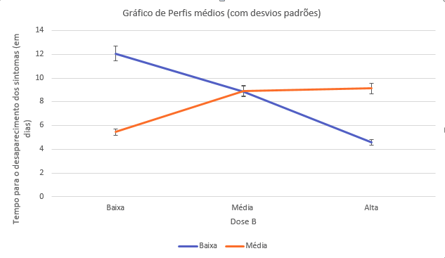

# Exercício 1

```{r echo=FALSE}
dados <- read.csv('/home/gui/Documentos/dados.csv', header = T, sep = ',', dec = ',')
```

a)\newline

\centering
\begin{tabular}{|c|cccc}
\hline
\multirow{2}{*}{\textbf{Estado civil}} & \multicolumn{4}{c|}{\textbf{Escolaridade}} \\ \cline{2-5} 
 & \multicolumn{1}{c|}{\begin{tabular}[c]{@{}c@{}}Ensino \\ Fundamental\end{tabular}} & \multicolumn{1}{c|}{\begin{tabular}[c]{@{}c@{}}Ensino\\  Médio\end{tabular}} & \multicolumn{1}{c|}{\begin{tabular}[c]{@{}c@{}}Ensino \\ Supeior\end{tabular}} & \multicolumn{1}{c|}{Total} \\ \hline
Casado & \multicolumn{1}{c|}{5} & \multicolumn{1}{c|}{12} & \multicolumn{1}{c|}{3} & \multicolumn{1}{c|}{20} \\ \hline
Solteiro & \multicolumn{1}{c|}{7} & \multicolumn{1}{c|}{6} & \multicolumn{1}{c|}{3} & \multicolumn{1}{c|}{16} \\ \hline
Total & \multicolumn{1}{c|}{12} & \multicolumn{1}{c|}{18} & \multicolumn{1}{c|}{6} & \multicolumn{1}{c|}{36} \\ \hline
\end{tabular}
\flushleft

b)\newline Fazendo uma nova tabela com as frequências relativas, podemos notar que o grau de escolaridade não tem muita dependência com o estado civil, no sentido que os casados tem um grau de escolaridade muito próximo dos solteiros, como podemos ver na tabela a seguir:

\centering
\begin{tabular}{|c|c|c|c|c|}
\hline
\multirow{2}{*}{\textbf{Estado civil}} & \multicolumn{4}{c|}{\textbf{Escolaridade}} \\ \cline{2-5} 
 & \begin{tabular}[c]{@{}c@{}}Ensino \\ Fundamental\end{tabular} & \begin{tabular}[c]{@{}c@{}}Ensino\\  Médio\end{tabular} & \begin{tabular}[c]{@{}c@{}}Ensino \\ Supeior\end{tabular} & Total \\ \hline
Casado & 13.89\% & 33.33\% & 8.33\% & 56.56\% \\ \hline
Solteiro & 19.44\% & 16.67\% & 8.33\% & 44.44\% \\ \hline
Total & 33.33\% & 50\% & 16.67\% & 100\% \\ \hline
\end{tabular}
\flushleft

c)
```{r echo =FALSE, warning=FALSE}
tbl <- table(dados$EstCivil, dados$Escolaridade)
qui_q <- chisq.test(tbl)

cont <- sqrt(1.9125/(1.9125+36))

t <- sqrt((1.9125/36)/sqrt(2))

```

A estatítica de qui-quadrado de Pearson: $X^2 = \sum_{j=1}^{n} \frac{(o_{j}-e_{j})^2}{e_{j}} \Rightarrow X^2 =$ `r qui_q[1]`

Coeficiente de Contingência: $C = \sqrt{\frac{X^2}{X^2+n}} \Rightarrow C =$ `r cont` 

Coeficiente de Tschuprov: $T = \sqrt{\frac{X^2/n}{\sqrt{(r-1)(c-1)}}} \Rightarrow T =$ `r t`

Analisando os coeficientes calculados, podemos notar que há uma certa independência nos dados, como ja era esperado apenas com uma análise empíraca dos dados.\newline

d)

```{r echo =FALSE}
m_out <- mean(dados$Salario[dados$Procedencia=="outra"])
m_int <- mean(dados$Salario[dados$Procedencia=="interior"])
m_cap <- mean(dados$Salario[dados$Procedencia=="capital"])

med_out <- median(dados$Salario[dados$Procedencia=="outra"])
med_int <- median(dados$Salario[dados$Procedencia=="interior"])
med_cap <- median(dados$Salario[dados$Procedencia=="capital"])

min_out <- min(dados$Salario[dados$Procedencia=="outra"])
min_int <- min(dados$Salario[dados$Procedencia=="interior"])
min_cap <- min(dados$Salario[dados$Procedencia=="capital"])

max_out <- max(dados$Salario[dados$Procedencia=="outra"])
max_int <- max(dados$Salario[dados$Procedencia=="interior"])
max_cap <- max(dados$Salario[dados$Procedencia=="capital"])

dp_out <- sd(dados$Salario[dados$Procedencia=="outra"])
dp_int <- sd(dados$Salario[dados$Procedencia=="interior"])
dp_cap <- sd(dados$Salario[dados$Procedencia=="capital"])

tam_out <- length(dados$Salario[dados$Procedencia=="outra"])
tam_int <- length(dados$Salario[dados$Procedencia=="interior"])
tam_cap <- length(dados$Salario[dados$Procedencia=="capital"])
```

### Medidas resumo de de pessoas do interior:

Número de pessoas: `r tam_int`

Média interior = $\bar{X} = \frac{1}{n} \sum_{i=1}^{n} x_{i} \Rightarrow \bar{X} =$ `r m_int`

Mediana = `r med_int`

Desvio Padrão = $DP(X) = \sqrt{Var(x)} = \sqrt{\frac{1}{n} \sum_{i=1}^{n} (x_{i}-\bar{x})^2} \Rightarrow DP(X) =$ `r dp_int`

Máximo = `r max_int`

Mínimo = `r min_int`


### Medidas resumo de de pessoas da capital:

Número de pessoas: `r tam_cap`

Média capital = $\bar{X} = \frac{1}{n} \sum_{i=1}^{n} x_{i} \Rightarrow \bar{X} =$ `r m_cap`

Mediana = `r med_cap`

Desvio Padrão = $DP(X) = \sqrt{Var(x)} = \sqrt{\frac{1}{n} \sum_{i=1}^{n} (x_{i}-\bar{x})^2} \Rightarrow DP(X) =$ `r dp_cap`

Máximo = `r max_cap`

Mínimo = `r min_cap`

### Medidas resumo de de pessoas de 'outra':

Número de pessoas: `r tam_out`

Média "outra" = $\bar{X} = \frac{1}{n} \sum_{i=1}^{n} x_{i} \Rightarrow \bar{X} =$ `r m_out`

Mediana = `r med_out`

Desvio Padrão = $DP(X) = \sqrt{Var(x)} = \sqrt{\frac{1}{n} \sum_{i=1}^{n} (x_{i}-\bar{x})^2} \Rightarrow DP(X) =$ `r dp_out`

Máximo = `r max_out`

Mínimo = `r min_out`

### Gráficos Box plots


```{r echo=FALSE}
boxplot(dados$Salario~dados$Procedencia, las=1, ylab= "número de salários mínimos")
 
```
\newpage Fazendo uma análise das medidas resumo dos funcionários do interior, capital e "outra" em cojunto o gráfico Box-Plot, chegamos a conclusão que a procedência não tem dependência com os salários.

# Exercício 2

\centering
\begin{tabular}{ccc}
\hline
\textbf{\begin{tabular}[c]{@{}c@{}}Dose de radiação \\ gama (cGy)\end{tabular}} & \textbf{\begin{tabular}[c]{@{}c@{}}Frequência de células\\ com múltiplos micronúcleos\end{tabular}} & \textbf{\begin{tabular}[c]{@{}c@{}}Total de células\\  examinadas\end{tabular}} \\ \hline
0 & 1 & 2373 \\
20 & 6 & 2662 \\
50 & 25 & 1991 \\
100 & 47 & 2047 \\
200 & 82 & 2611 \\
300 & 207 & 2442 \\
400 & 254 & 2838 \\
500 & 285 & 1746 \\ \hline
\end{tabular}
\flushleft

```{r echo=FALSE}
rr_0.20 <- (6/2662)/(1/2373)
rr_0.50 <- (25/1991)/(1/2373)
rr_0.100 <- (47/2047)/(1/2373)
rr_0.200 <- (82/2611)/(1/2373)
rr_0.300 <- (207/2442)/(1/2373)
rr_0.400 <- (254/2838)/(1/2373)
rr_0.500 <- (285/1746)/(1/2373)

rc_0.20 <- ((6/2662)*(2372/2373))/((1/2373)*(2656/2662))
rc_0.50 <- ((25/1991)*(2372/2373))/((1/2373)*(1966/1991))
rc_0.100 <- ((47/2047)*(2372/2373))/((1/2373)*(2000/2047))
rc_0.200 <- ((82/2611)*(2372/2373))/((1/2373)*(2529/2611))
rc_0.300 <- ((207/2442)*(2372/2373))/((1/2373)*(2235/2442))
rc_0.400 <- ((254/2838)*(2372/2373))/((1/2373)*(2584/2838))
rc_0.500 <- ((285/1746)*(2372/2373))/((1/2373)*(1461/1746))
```

a)\newline \newline razão de chances(0-20): $\frac{\pi_{1}}{\pi_{0}} = \frac{6/2662}{1/2373} =$ `r rr_0.20`\newline 

razão de chances(0-50): $\frac{\pi_{1}}{\pi_{0}} = \frac{25/1991}{1/2373} =$ `r rr_0.50`\newline 

razão de chances(0-100): $\frac{\pi_{1}}{\pi_{0}} = \frac{47/2047}{1/2373} =$ `r rr_0.100`\newline 

razão de chances(0-200): $\frac{\pi_{1}}{\pi_{0}} = \frac{82/2611}{1/2373} =$ `r rr_0.200`\newline

razão de chances(0-300): $\frac{\pi_{1}}{\pi_{0}} = \frac{207/2442}{1/2373} =$ `r rr_0.300`\newline 

razão de chances(0-400): $\frac{\pi_{1}}{\pi_{0}} = \frac{254/2838}{1/2373} =$ `r rr_0.400`\newline

razão de chances(0-500): $\frac{\pi_{1}}{\pi_{0}} = \frac{285/1746}{1/2373} =$ `r rr_0.500`\newline


b)\newline \newline razão de chances(0-20): $\frac{\pi_{1}*(1-\pi_{0})}{\pi_{0}*(1-\pi_{1})} = \frac{(6/2662)*(2372/2373)}{(1/2373)*(2656/2662)} =$ `r rc_0.20`\newline 

razão de chances(0-50): $\frac{\pi_{1}*(1-\pi_{0})}{\pi_{0}*(1-\pi_{1})} = \frac{(25/1991)*(2372/2373)}{(1/2373)*(1966/1991)} =$ `r rc_0.50`\newline 

razão de chances(0-100): $\frac{\pi_{1}*(1-\pi_{0})}{\pi_{0}*(1-\pi_{1})} = \frac{(47/2047)*(2372/2373)}{(1/2373)*(2000/2047)} =$ `r rc_0.100`\newline 

razão de chances(0-200): $\frac{\pi_{1}*(1-\pi_{0})}{\pi_{0}*(1-\pi_{1})} = \frac{(82/2611)*(2372/2373)}{(1/2373)*(2529/2611)} =$ `r rc_0.200`\newline 

razão de chances(0-300): $\frac{\pi_{1}*(1-\pi_{0})}{\pi_{0}*(1-\pi_{1})} = \frac{(207/2442)*(2372/2373)}{(1/2373)*(2235/2442)} =$ `r rc_0.300`\newline 

razão de chances(0-400): $\frac{\pi_{1}*(1-\pi_{0})}{\pi_{0}*(1-\pi_{1})} = \frac{(254/2838)*(2372/2373)}{(1/2373)*(2584/2838)} =$ `r rc_0.400`\newline 

razão de chances(0-500): $\frac{\pi_{1}*(1-\pi_{0})}{\pi_{0}*(1-\pi_{1})} = \frac{(285/1746)*(2372/2373)}{(1/2373)*(1461/1746)} =$ `r rc_0.500`\newline

c)\newline \newline Fazendo uma análise dos riscos relativos e as razões de chances concluímos que, conforme aumenta a dose de radiação, aumenta também a quantidade de células com múltiplos micronucleos. Alem disso, as razões são bem proximas, com a razão de chances sendo sempre maior.\newline


# Exercício 3

a)\newline

\centering Tabela  

\centering
\begin{tabular}{|l|l|l|l|}
\hline
 & HIV +(D) & HIV -(ND) & Total \\ \hline
Teste +(T+) & 50 & 25 & 75 \\ \hline
Teste -(T-) & 50 & 75 & 125 \\ \hline
Total & 100 & 100 & 200 \\ \hline
\end{tabular}
\flushleft

b)\newline Sensibilidade : $\hat{S} = P(T+ | D) = \frac{50}{100} = 0.5$
\newline

Especificidade : $\hat{E} =P(T- | ND) = \frac{75}{100} = 0.75$ 
\newline

c)\newline Valor Preditivo Positivo (VPP) : $\hat{VPP} = P(D | T+) = \frac{50}{75}$
\newline

Valor Preditivo Negativo (VPN) : $\hat{VPN} = P(ND | T-) = \frac{75}{125} = 0.6$
\newline

d)\newline Acurácia do teste (AC) : $\hat{AC} = P[(ND \cap T-) \cup (D \cap T+)] = \frac{50+75}{200} = 0.625$ 


# Exercício 4

\centering
\begin{tabular}{clll}
\hline
\multirow{2}{*}{\begin{tabular}[c]{@{}c@{}}Doses da \\ Substância A\end{tabular}} & \multicolumn{3}{l}{Dose da Substância B} \\ \cline{2-4} 
 & Baixa & Média & Alta \\ \hline
Baixa & 10.4 & 8.9 & 4.8 \\
Baixa & 12.8 & 9.1 & 4.5 \\
Baixa & 14.6 & 8.5 & 4.4 \\
Baixa & 10.5 & 9.0 & 4.6 \\
Média & 5.8 & 8.9 & 9.1 \\
Média & 5.2 & 9.1 & 9.3 \\
Média & 5.5 & 8.7 & 8.7 \\
Média & 5.3 & 9.0 & 9.4 \\ \hline
\end{tabular}
\flushleft
\newpage

a) 

\centering
\begin{tabular}{|c|c|c|c|c|}
\hline
\begin{tabular}[c]{@{}c@{}}Doses da \\ Substância A\end{tabular} & Doses da Substância B & n & Média & Desvio Padrão \\ \hline
\multirow{3}{*}{Baixa} & Alta & 4 & 4.57 & 0.148 \\ \cline{2-5} 
 & Média & 4 & 8.87 & 0.228 \\ \cline{2-5} 
 & Baixa & 4 & 12.75 & 1.74 \\ \hline
 & Alta & 4 & 9.12 & 0.268 \\ \cline{2-5} 
\multirow{2}{*}{Média} & Média & 4 & 8.92 & 0.148 \\ \cline{2-5} 
 & Baixa & 4 & 5.45 & 0.23 \\ \hline
\end{tabular}
\flushleft

Logo, fazendo uma análise descritiva com base na tabela acima concuímos que a dose da substância A tem que ser BAIXA e a dose da substância B tem que ser ALTA, observando o intervalo da média mais ou menos o desvio padrão.\newline

b)\newline Para fazer a comparação de 6 tratamentos quanto ao tempo para desapareciemnto dos sistomas o modelo a ser utilizado é o ANOVA, sendo os seus fatores: Doses da suabtânica A, e dose da sbstância B, com 2 e 3 níveis respectivamente.\newline


c)\newline

```{r echo=FALSE, out.width = '100%'}

```
Levando em conta médias e desvios padrões, vemos que: Há uma interação entre os fatores pois eles se cruzam, mesmo que tenham pequenos desvios padrões.

\newpage
# Exercício 5

```{r echo=FALSE}
valor <- c(18800,24400,20400,35800,14800,40400,49000,14500,37300,54700)

q_dev <- c(445,539,1212,2237,479,1181,4187,409,1002,2062) 

dados1 <- data.frame(valor, q_dev)

modelo.regressao <- lm(q_dev ~ valor, data = dados1)

c_p <- cor(valor,q_dev, method="pearson")

c_s <- cor(valor,q_dev, method="spearman")
```


a)\newline Coeficiente de correlação de Pearson = `r c_p` \newline Coeficiente de correlação de Spearman = `r c_s`\newline

O coefeciente de correlação de Pearson nos diz que entre as váriáveis "Valor do imóvel" e "quantia devida" tem uma correlação forte e positiva, ou seja, conforme aumenta o valor do imóvel maior é sua dívida. E o coeficiente de Spearman confirma que a correalção é mesmo linear, pois seu valor foi muito próximo da de Pearson.\newline

b)\newline Analisando o coeficiente de correlação linear e o gráfico de disperção de forma intuitiva vemos que o modelo de regressão linear simples melhor se adequa a esta situação, logo:

$Y = \hat{\beta}X + \hat{\alpha}$ com $\hat{\alpha} = -540.40$ e $\hat{\beta} = 0.06178 \Rightarrow Y = 0.06178X -540.40$

```{r echo=FALSE}

plot(q_dev ~ valor, las=1, xlab = 'Valor(R$)', ylab = 'Quantia devida (R$)')
abline(modelo.regressao,col="blue")
```

c)\newline Usando a equação para prever a taxa média devida cujo valor é igual a R$42.000,00 é:

$Y = 0.06178*42400 - 540.40 \Rightarrow Y = 2079.7$. Ou seja, o valor é aproximadamente: R$2080,00

d)\newline o coeficiente $R^{2}$ = 0.567, ou seja, o modelo ajustado com o valor da propriedade explica 57% da variação total dos valores da dívida com a prefeitura.